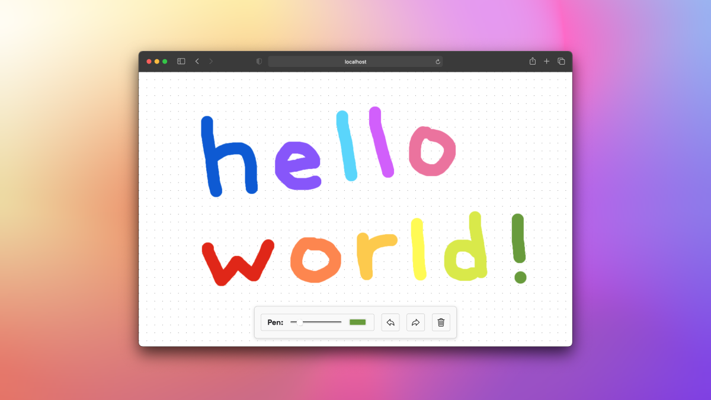

# Ephemeral Canvas

A minimal drawing app with no save. _Built using [Delgada](https://github.com/delgada-ui/cli-rust-compiler) and the 2D canvas graphics API._



## Usage

```
npm install
npm start
```

## License

[MIT](LICENSE)
